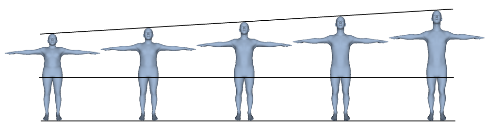
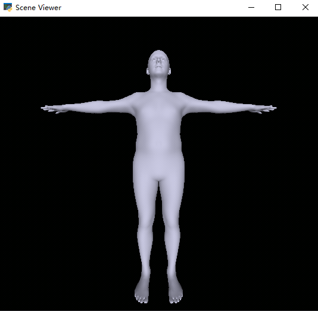

# Sematic Controllable SMPL Shape

Accurate height control without variation of arm span, inseam height, chest, waist and hip



## Dependencies for demo

```
pytorch
numpy
trimesh
pyrender
smplx
```

You need to put `SMPLX_MALE.npz` into `data/body_models/smplx` folder.

## Demo



- `1`: modify height
- `2`: modify inseam height
- `3`: modify arm span
- `4`: modify chest
- `5`: modify waist
- `6`: modify hip
- `-`: decrease 0.5cm
- `+`: increase 0.5cm
- `space`: new random shape


## Roadmap

- [x] SMPL-X shape control
- [ ] SMPL shape control
- [ ] SMPL-H shape control
- [ ] Female shape control

when paper is available(maybe a long long time):

- [ ] SMPL shape generation
- [ ] semantically controllable SMPL shape parameter generation

## Usage

```python
import torch
import numpy as np

# ...

height = torch.from_numpy(np.load('data/smplx_params/smplx_params_height_1cm_b10.npz')['betas']) # [1, 10]
modified_betas = betas + height * 3.0  # increase height by 3.0 cm
```

